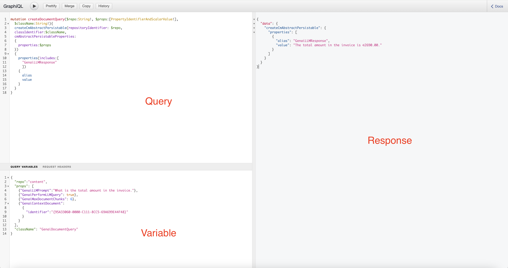
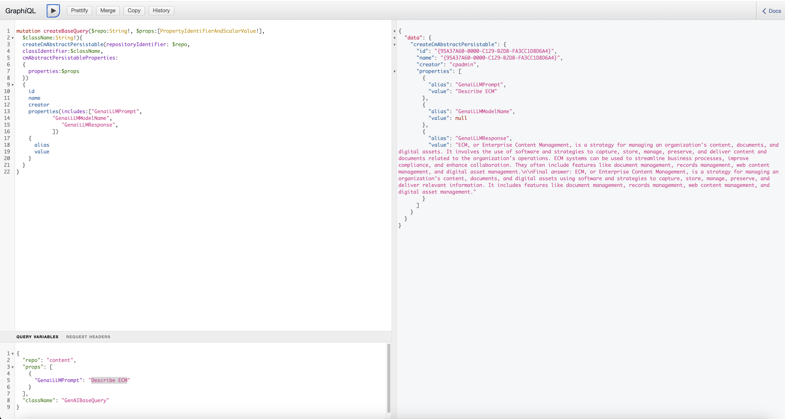
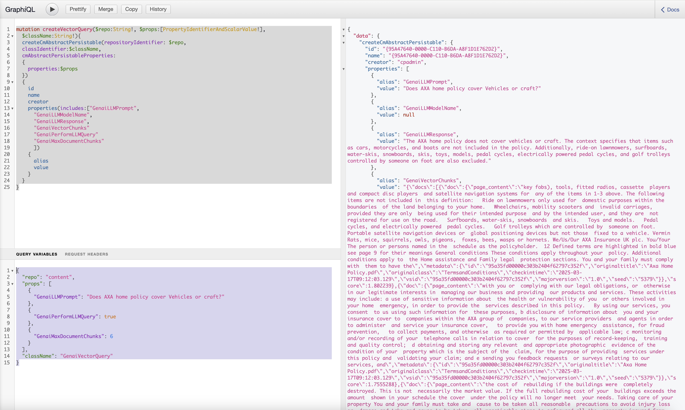
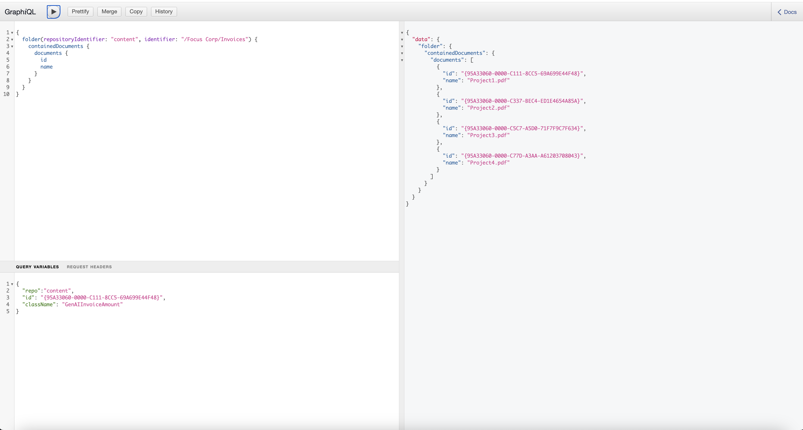
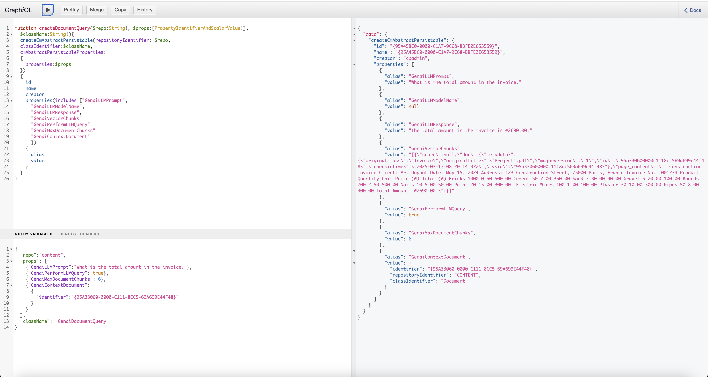
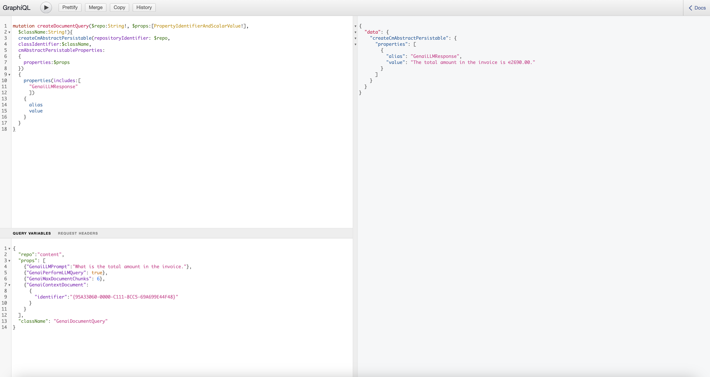
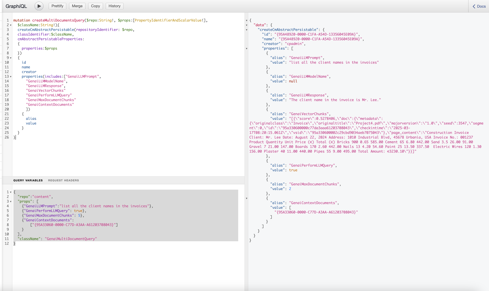
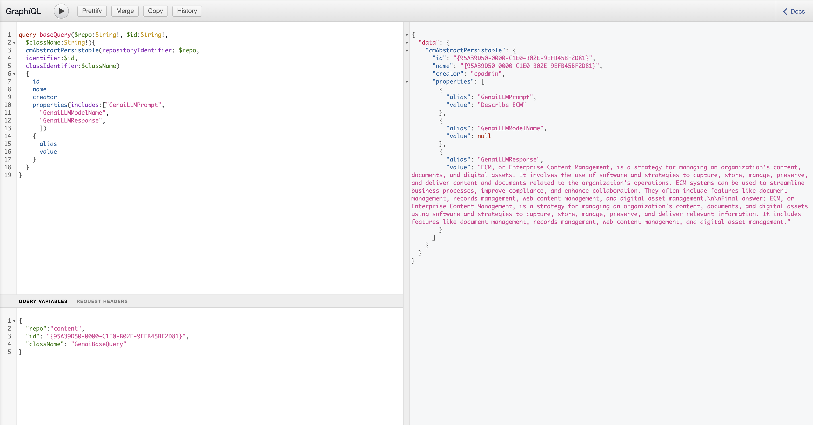

# This a set of graphql example : 

## How to use the GraphiQl

GraphiQL is an interactive in-browser tool designed for exploring and testing GraphQL APIs. It provides a user-friendly interface that allows developers to write, edit, and execute GraphQL queries with ease. With features like autocomplete and syntax highlighting, GraphiQL helps streamline the development process by enabling quick experimentation and debugging of API endpoints, making it an invaluable resource for anyone working with GraphQL.

IWeIn our exploration of the GraphiQL interface, we'll utilize three key sections: Query, Variables, and Response. The Query section is where we construct and execute our GraphQL queries, allowing us to retrieve specific data from the API. The Variables section enables us to pass dynamic values to our queries, making them more flexible and reusable. Finally, the Response section displays the results of our queries, offering insights into the data structure and content returned by the server. Together, these components facilitate efficient data retrieval and manipulation.



## Step 1: Ask a generic question

Copy and paste on to each section : 

### Query section

``` graphql
mutation createBaseQuery($repo:String!, $props:[PropertyIdentifierAndScalarValue!],
  $className:String!){
  createCmAbstractPersistable(repositoryIdentifier: $repo, 
  classIdentifier:$className,
  cmAbstractPersistableProperties:
  {
    properties:$props
  })
  {
    id
    name
    creator
    properties(includes:["GenaiLLMPrompt",
		        "GenaiLLMModelName", 
      			   "GenaiLLMResponse",
      			])
    {
      alias
      value
    }
  }
}
```
### Variable section

First example

```json
{
  "repo":"content",
  "props": [
    {"GenaiLLMPrompt":"Describe ECM"}
  ],
  "className": "GenAIBaseQuery"
}
```

Second Exmaple

```json
{
  "repo":"content",
  "props": [
    {"GenaiLLMPrompt":"Translate the following phrase in grec : Welcom to Content Assistant"}
  ],
  "className": "GenAIBaseQuery"
}
```

### Example:



Each response has an ID, allowing us to track it. We can monitor all answers provided by the server for control purposes. This can be used to improve the model.

## Step 2: Ask your repository 

### Query Section

```graphql
mutation createVectorQuery($repo:String!, $props:[PropertyIdentifierAndScalarValue!],
  $className:String!){
  createCmAbstractPersistable(repositoryIdentifier: $repo, 
  classIdentifier:$className,
  cmAbstractPersistableProperties:
  {
    properties:$props
  })
  {
    id
    name
    creator
    properties(includes:["GenaiLLMPrompt",
      "GenaiLLMModelName", 
      "GenaiLLMResponse",
      "GenaiVectorChunks"
      "GenaiPerformLLMQuery"
      "GenaiMaxDocumentChunks"
      ])
    {
      alias
      value
    }
  }
}
```

### Variable Section

```json
{
  "repo": "content",
  "props": [
    {
      "GenaiLLMPrompt": "Does AXA home policy cover Vehicles or craft?"
    },
    {
      "GenaiPerformLLMQuery": true
    },
    {
      "GenaiMaxDocumentChunks": 6
    }
  ],
  "className": "GenaiVectorQuery"
}
```

### Response




## Step 3: list documents inside a folder.

### Query Section

```graphql
{
  folder(repositoryIdentifier: "content", identifier: "/Focus Corp/Invoices") {
    containedDocuments {
      documents {
        id
        name
      }
    }
  }
}
```

### Variable Section

no content required 

### Response



## (Step 4) Gen AI on specifc document 
```graphql
mutation createDocumentQuery($repo:String!, $props:[PropertyIdentifierAndScalarValue!],
  $className:String!){
  createCmAbstractPersistable(repositoryIdentifier: $repo, 
  classIdentifier:$className,
  cmAbstractPersistableProperties:
  {
    properties:$props
  })
  {
    id
    name
    creator
    properties(includes:["GenaiLLMPrompt",
      "GenaiLLMModelName", 
      "GenaiLLMResponse",
      "GenaiVectorChunks"
      "GenaiPerformLLMQuery"
      "GenaiMaxDocumentChunks"
      "GenaiContextDocument"
      ])
    {
      alias
      value
    }
  }
}
```

### variable section

```json
{
  "repo":"content",
  "props": [
    {"GenaiLLMPrompt":"What is the total amount in the invoice."},    
    {"GenaiPerformLLMQuery": true},
    {"GenaiMaxDocumentChunks": 6},
    {"GenaiContextDocument": 
    	{
        "identifier":"{95A33060-0000-C111-8CC5-69A699E44F48}"
      }
    }
  ],
  "className": "GenaiDocumentQuery"
}
```

## response 



### STEP-4 B: simplified verison 

### 
```graphql
mutation createDocumentQuery($repo:String!, $props:[PropertyIdentifierAndScalarValue!],
  $className:String!){
  createCmAbstractPersistable(repositoryIdentifier: $repo, 
  classIdentifier:$className,
  cmAbstractPersistableProperties:
  {
    properties:$props
  })
  {
    properties(includes:[
      "GenaiLLMResponse"
      ])
    {
      alias
      value
    }
  }
}
```

### variable section
```json
{
  "repo":"content",
  "props": [
    {"GenaiLLMPrompt":"What is the total amount in the invoice."},    
    {"GenaiPerformLLMQuery": true},
    {"GenaiMaxDocumentChunks": 6},
    {"GenaiContextDocument": 
    	{
        "identifier":"{95A33060-0000-C111-8CC5-69A699E44F48}"
      }
    }
  ],
  "className": "GenaiDocumentQuery"
}
```

### Response:




## Step 5: Search in multiple document : 


### Query Section 

```graphql
mutation createMultiDocumentsQuery($repo:String!, $props:[PropertyIdentifierAndScalarValue!],
  $className:String!){
  createCmAbstractPersistable(repositoryIdentifier: $repo, 
  classIdentifier:$className,
  cmAbstractPersistableProperties:
  {
    properties:$props
  })
  {
    id
    name
    creator
    properties(includes:["GenaiLLMPrompt",
      "GenaiLLMModelName", 
      "GenaiLLMResponse",
      "GenaiVectorChunks"
      "GenaiPerformLLMQuery"
      "GenaiMaxDocumentChunks"
      "GenaiContextDocuments"
      ])
    {
      alias
      value
    }
  }
}
```

### variable section

```json
{
  "repo":"content",
  "props": [
    {"GenaiLLMPrompt":"list all the client names in the invoices"},    
    {"GenaiPerformLLMQuery": true},
    {"GenaiMaxDocumentChunks": 5},
    {"GenaiContextDocuments": 
        ["{95A33060-0000-C77D-A3AA-A61203708043}"]    
    }
  ],
  "className": "GenaiMultiDocumentQuery"
}
```


### Response: 



## Step 6: Search for historical request.


### Query section

```graphql
query baseQuery($repo:String!, $id:String!,
  $className:String!){
  cmAbstractPersistable(repositoryIdentifier: $repo,
  identifier:$id,
  classIdentifier:$className)
  {
    id
    name
    creator
    properties(includes:["GenaiLLMPrompt",
      "GenaiLLMModelName", 
      "GenaiLLMResponse",
      ])
    {
      alias
      value
    }
  }
}
```
### variable section

```json
{
  "repo":"content",
  "id": "{95A39D50-0000-C1E0-B02E-9EFB45BF2D81}",
  "className": "GenaiBaseQuery"
}
```

### response : 


